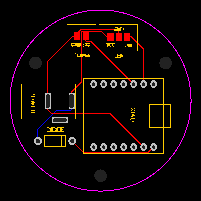
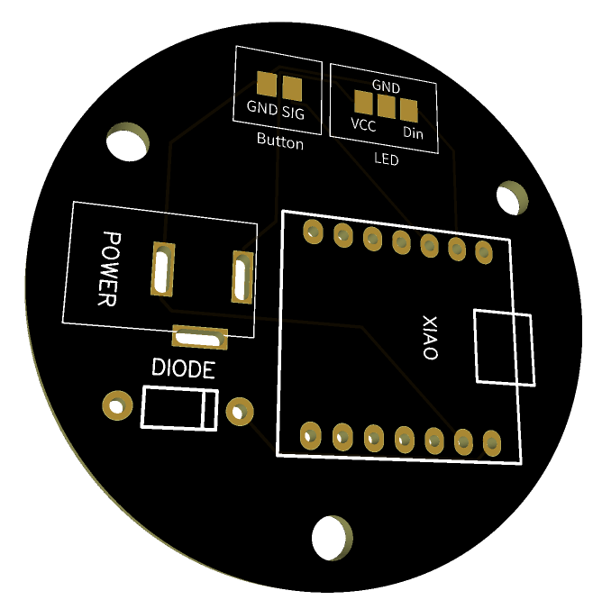
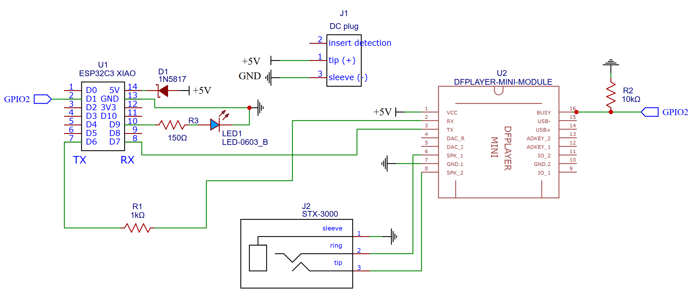

# StoryButtons
StoryButtons is an interactive audio installation featuring wireless LED-ringed buttons that play recorded stories from children about their inventions. Designed for libraries and educational spaces, each button triggers a unique story, creating a playful and engaging way to explore young creativity. This repository contains the code, hardware setup, and deployment instructions for building your own StoryButtons system.

*⚡A  [comon](http://www.comon.gent) spark⚡*    
*Tinkered with* ❤ *by Bas Baccarne*   
*Supported with*🔥 *by Jeroen Bougonjon, Line Winey, Margot Bulcke, Fran Burger & Stephanie Van Hove*

## Concept

**Independent push buttons**
  * One button per invention (as many as you want), each powered by 5V.
  * When pushed, they send their ID to the hub that answers with the length of the associated audio file (over ESP-NOW).
  * A second push while playing stops the audio
  * Other buttons can interupt

**Listen hub**
  * Single hub (or multiple if you want them on multiple places), powered by 5V.
  * Listens to incoming IDs and plays the associated audio file (and send back duration to the sending button).
  * These audiofiles are prerecorded and stored on an sd card (DFplayer mini).
  * The audio can be listened to through headphones.

  
  
   
  
  
  

## Parts and electronic components

  
🪛 Show the full Bill of Materials

| Part     | Link    | Cost   | Amount  |
| -------- | ------- |------- | ------- |
| **Independent Push Buttons** (N=4)|
||
|  XIAO ESP32S3  | [Seeed](https://wiki.seeedstudio.com/XIAO_ESP32S3_Getting_Started/)   | $30,40 | 4 |
|  Stainless steel button | [Conrad](https://www.conrad.be/nl/p/tru-components-tc-9563704-druktoets-12-v-0-005-a-1x-uit-aan-contact-element-o-x-h-24-7-mm-x-14-5-mm-ip65-1-stuk-s-bulk-2390926.html?searchType=SearchRedirect)          | €33,95 | 4 |
| LED ring | [Adafruit](https://www.adafruit.com/product/1463) | $47,80 | 4 |
| Diode | [Digikey](https://www.digikey.be/en/products/detail/stmicroelectronics/1N5819/1037326)| $0,72 | 4 |
| DC Barrel jack connector | [Digikey](https://www.digikey.be/en/products/detail/schurter-inc/4840-2201/2644239) | $12,00| 4 |
| Acryl sheet | [kunstofplaten](https://kunststofplaten.be/) (experiment)| -- | -- |
| Galaxy PLA | [Bambu](https://eu.store.bambulab.com/nl/products/pla-galaxy?srsltid=AfmBOoo9sBeG0sJasqFpaCiYi2BV-K_h8VwQ-q00EmTJZ01FLYhFAnA5) |-- | --|
| 5V power adapter | [Digikey](https://www.digikey.be/en/products/detail/globtek-inc/WR9MA2000LCPMFR6B/8598279)| $9,26 | 1 | 
| Female DC barrel connection PCB | [Digikey](https://www.digikey.be/en/products/detail/sparkfun-electronics/13126/17828120) | $1,25 | 1 |
| Male DC barrel connections | [Digikey](https://www.digikey.be/en/products/detail/globtek-inc/V01-TWISTLOCK/16515756) | $7,68 | 4 |
| Custom PCB | [JLCPCB (n=5)](https://jlcpcb.com/) | €30,00 |  1 |
| Kapton tape | [Digikey](https://www.digikey.be/nl/products/detail/olimex-ltd/kapton-tape10mm/19204468) | $2,84| 1 |
| M3x4x5 threaded inserts | [CNC Kitchen (n=100)](https://cnckitchen.store/products/made-for-voron-gewindeeinsatz-threaded-insert-m3x5x4-100-stk-pcs) | €10 | 1 |
| Hex Standoffs M3X0.5 19mm | [Digikey](https://www.digikey.be/nl/products/detail/w%C3%BCrth-elektronik/971190321/6174653) | $7,35 | 1 |
| Hex Standoffs M3X0.5 19mm | [Digikey](https://www.digikey.be/nl/products/detail/w%C3%BCrth-elektronik/971190321/6174653) | $7,35 | 1 |
| M3x4 bolts | [Digikey](https://www.digikey.be/nl/products/detail/keystone-electronics/29314/1532209) | $5,51 | 1 |
| Header stack 7p | [Digikey](https://www.digikey.be/en/products/detail/sullins-connector-solutions/PPTC071LFBN-RC/810146)| $4,37 | 8 |
| Adhesive Cable Tie Mounts | [Digikey](https://www.digikey.be/en/products/detail/phoenix-contact/3240707/4461932) | $1,42 | 1|
| **Listen hub** |
||
| breadboard |||
| XIAO ESP32S3  | [Seeed](https://wiki.seeedstudio.com/XIAO_ESP32S3_Getting_Started/)   | $7,60 | 1 |
| DFPlayer Mini    | [DFRobot](https://wiki.dfrobot.com/DFPlayer_Mini_SKU_DFR0299)      | $5,90 | 1 |
| Female DC barrel to terminal | [Digikey](https://www.digikey.be/en/products/detail/pololu/2449/19529193) | $2,95 | 1 |
| Terminal block | [Digikey](https://www.digikey.be/en/products/detail/on-shore-technology-inc/OSTVN02A150/1588862) | $1,74 | 1|
| 5V power adapter | [Digikey](https://www.digikey.be/en/products/filter/ac-dc-desktop-wall-power-adapters/130)| $9,26 | 1 | 
| Female 3.5mm jack (audio) | [Digikey](https://www.digikey.be/en/products/detail/kycon-inc/STX-3000/9975995) | $0,71 | 1 |
| Headphone | [JBL Wired](https://www.bol.com/be/nl/p/jbl-tune-500-on-ear-koptelefoon-zwart/9200000098045179/) | €26 | 1 |
| Blue Led |--|--| 1 |
| 150 Ω resistor | -- | -- | 1 |
| 1kΩ resistor | --| -- | 1|
| 10kΩ resistor | --| -- | 1|

## Construction & wiring
### 🔘 Button module  
* The button is a stainless steel button   

* The top of the module is a lasercutted piece of 3mm acryl
  * `Interal note`
    * 3mm perfect settings local laser: `power 65% - speed 0.6%`
    * 1mm perfect settings local laser: `power 50% - speed 0.8%`
* The led ring holder, the sleeve and the bottom piece are 3D printed
  * 🧊 [Downloadable model in Fusion 360](https://a360.co/4kx6gfg)
  * Use threaded inserts on the bottom of the ledring for mounting
* With a custom PCB inside (see Parts list)
  
  
  
  

  
  
  
  
  

### 🎧 Listen Module
* Technical set-up:   

  * Since we're only creating a single listening hub, we're building this one on a breadboard.    

  * See parts list and schematic for the components and wiring.   
  * A blue status led indicates if something is playing. The device is powered by 5V and has a 3.5mm audio jack for headphones.

    

   

* Physical set-up:
  * We still need to define the final form factor.   

  * The idea is to install this in a big teddybear
  * Currently, eveything is integrated in this box (threaded inserts on the sides on the bottom components)
    *  🧊 [Downloadable model in Fusion 360](https://a360.co/3ZGuyeM)

## Code
First retrieve the MAC-adresses of the buttons and hub using [this code](tests/mac.ino) and add this to the code (all buttons ids in the hub, hub in the buttons). Next, assign each button ID to the audio files on the SD card and change the metadata in the hub code. Then set the button ID for each button before oploading the code.    

* 🎧⌨️ [Code for the button](src/button.ino) 
* 🔘⌨️ [Code for the hub](src/hub.ino)   
* 🎙️🔗 [Secure link with our audiofiles](https://dekrookbe.sharepoint.com/:f:/s/Comon/EjXA12W-Oa9GrY0zcC7_DVkBA-nyHTXGFnvPkcDvEJWyHQ?e=oS5d5c)   

    

* `Internal reference`   
  | Part     | MAC    | 
  | -------- | ------- |
  | hub | `48:27:E2:E7:1B:F4` |
  | button 1 | `D8:3B:DA:73:C6:74`|
  | button 2 | `D8:3B:DA:73:C4:58`|
  | button 3 | `D8:3B:DA:46:59:5C`|
  | button 4 | `D8:3B:DA:46:64:00`|

## Tests
> **_NOTE:_** This is the overview of tests and micro-experiments that are part of this project.   

**Input** (touch - Button) 
* Push: [Pull-up button](test/push.ino)
* Touch: [Continuous reading of capacitive touch pads](tests/capacitive.ino)   
(curious towards the 9 capacitive touchpads on the XIAO ESP32S3)   

**Output** (audio - DFplayer)   
* [Play sound file](tests/audio.ino)   

**Output** (led ring - Neopixel)
* [LED ring simple chase animation](tests/ledring.ino)   
* [LED ring led by led count + print for debugging](tests/led_test.ino)
* [LED ring countdown](tests\ledring_countdown.ino)
* [LED softpulse](tests\softpulse.ino)

**Interations**   
* [Hold to listen](tests/holdtolisten.ino)
* [Push & start led countdown](tests/push_and_count.ino)

**Communication** (ESP-NOW)   
* [Step 1 - Get MAC adress of the devices](tests/mac.ino)
* [Step 2 - send data & listen to response (device MAC D8:3B:DA:73:C6:74)](tests/device1.ino)
* [step 3 - listen to response and answer when message received (device MAC D8:3B:DA:73:C4:58)](tests/device2.ino)
* [Play sound ID based on ESP-NOW signal](tests/targetted_audio.ino) from a [button](tests/button_espnow.ino)

## Background
> **_NOTE:_** This is section covers some research and background information
### Create a custom PCB
* For this case, I'm creating a custom PCB to illustrate the flow on a simple example
* If you're new to this, it might be easer to work in [easyEDA](easyeda.com), then import the STEP file in you CAD program
* ▶️ [Good tutorial](https://www.youtube.com/watch?v=MsdJgEinb34&t=23s)
* If you want to step up your game: work with the intergrated PCB modules in CAD (eg. Fusion 360 has the Electronics workspace, which is built on the former Eagle PCB design tool Autodesk acquired). This is called `MCAD (mechanical-electrical co-design)` integration.

#### Workflow
This is my recommended workflow to create your own PCB (basic version)
1. **``Test``**: Test circuit and code on a breadboard (with components you have laying around).
2. **``Parts``**: Research the components you need (tip: note down part numbers). It's a good idea to order and test them first.
3. **``Place``**: Open an easyEDA project, search and place your components (cfr part numbers) using in library module. Easy EDA has a lot of offical and user contributed parts. Crosscheck, or create your own where needed (see below)
4. **``Connect``**: Wire your components together using their schamatic representation (Circruit design)
5. **``Position``**: Position components on the two sides of the breadboard
6. **``refine``**: Optimize wires (auto-routing usually does a good job) & add text
7. **``Export``**: Export OBJ file for import in CAD (crosscheck & go back if corrections are needed).
8. **``Order``**: EasyEDA allows direct orders on PCBWay. For a EU alternative: check [Eurocicruits](https://www.eurocircuits.com/).

#### Parts
When adding parts (rough notes)   
* SMD vs through hole
* Part are built out of 3 components: (1) schematic (2) footprint (3) 3D model
* Check if there is a version in the library (crosscheck foorptint)
* If not: create your own schematic & footprint (start from [datasheet](https://www.schurter.com/en/datasheet/typ_4840.2201.pdf) and [available models](https://www.digikey.be/nl/models/2644239))
* In some software you can import this directly (for easyEDA, this is a payed feature)
* Create you own component (or crosscheck user contributed part):
  * Create new schematic
    * Schematic representation
    * Functional: add pins (figure out: name versus number)
    * Add metadata (data sheet, url, manufacturer, ...)
    * Use correct prefix (e.g. for a jack connection, this is J?)  
  * Create new footprint
    * Start with reference point and use x-y coordinates
    * Add pads (number them correctly)
    * Use silk layer for things you want to print on the PCB
    * Go back to schematic and add footprint
  * Add 3D Model
    * Look for wrl file online
    * Open Tools 3D model manager
    * Go to footprint and add 3D model
* Typical width of the ring: 0.15 mm to 0.2 mm
