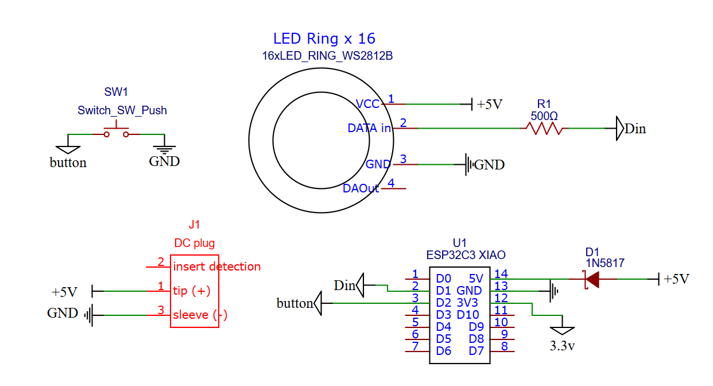

# Listenmodule
small XIAO set-up that supports "touch to listen" interactions

*by: Bas Baccarne*

**components**
| Part     | Link    | Cost   |
| -------- | ------- |------- |
| XIAO ESP32S3  | [Seeed](https://wiki.seeedstudio.com/XIAO_ESP32S3_Getting_Started/)   | €7 |
| Stainless steel button | [Conrad](https://www.conrad.be/nl/p/tru-components-tc-9563704-druktoets-12-v-0-005-a-1x-uit-aan-contact-element-o-x-h-24-7-mm-x-14-5-mm-ip65-1-stuk-s-bulk-2390926.html?searchType=SearchRedirect)          | €7 |
| Capacitive Touch Sensor | [Seeed](https://wiki.seeedstudio.com/Grove-Touch_Sensor/) | €4|
| DFPlayer Mini    | [DFRobot](https://wiki.dfrobot.com/DFPlayer_Mini_SKU_DFR0299)      | €6 |
| LED ring | [Adafruit](https://www.adafruit.com/product/1463) | €24 |
| Female 3.5mm jack | [Allekabels](https://www.onlinekabelshop.nl/35mm-jack-v-stereo-open-eind-audiokabel-zwart-030.html) | €2 |
| Headphone | [JBL Wired](https://www.bol.com/be/nl/p/jbl-tune-500-on-ear-koptelefoon-zwart/9200000098045179/) | €26 |
| **Total** |  | **€76** |

**schematic**

  

**tests**   
* [Button Push](tests/touch.ino)
* [Play sound file](tests/sound.ino)
* [Hold to listen](tests/holdtolisten.ino)

**Actions**
- [ ] LED Ring for Duration
- [ ] Technical Concept multiple stories & in situ installation (power etc)
- [ ] Housing (& custom PCB?)
